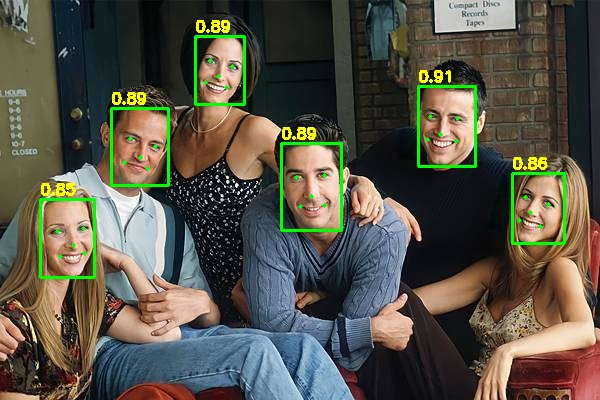
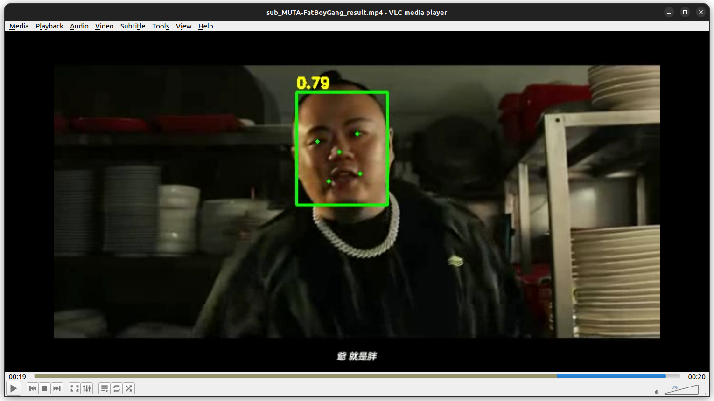

# scrFDOnlyInference
- scrFD is an efficient, high-accuracy face detection approach initially described in Arxiv, accepted by ICLR-2022, and released by InsightFace.
- We export various scrFD models from ONNX to TFLite (float/int) for face and 5-point landmark detection tasks. Additionally, we provide minimal example code for image/video inference.
- Evaluation on the WiderFace dataset is performed using several self-defined protocols.
- We provide error analysis for cases where only rough face detection is necessary, disregarding accurate localization or small face detection.
- Speed tests are conducted on CPU/GPU, and we include metrics such as FLOPs, number of parameters, memory footprint, and runtime memory estimation.

# Environment:
## Model Convertion
- onnx==1.15.0
- tensorflow==2.12.1
- see: [onnx2tf](https://github.com/PINTO0309/onnx2tf)
- and: [netron](https://github.com/lutzroeder/netron)
## Only Inference
- tensorflow==2.12.1
- opencv-python==4.9.0.80
## Model analysis
- see: [tflite2json2tflite](https://github.com/PINTO0309/tflite2json2tflite)
## Evaluation and Error Analysis
- see: [WiderFace-Evaluation](https://github.com/wondervictor/WiderFace-Evaluation)
# Quick Start:
- `python scrfd.py`

- `python video_inference_fdlm.py`

# Step by step
## Export TFLite Models
- download official onnx models from [here](https://github.com/deepinsight/insightface/releases)
  - we download buffalo_sc.zip, put it to the models folder and unzip
  - the folder structure will looks like: models/det_500m.onnx 
  - various model size and official benchmark table are [here](https://github.com/deepinsight/insightface/tree/master/model_zoo)
- update opset ver and set fix input shape using:
  - `python export_modified_onnx.py --hw=480,640`
    - hw should divisible by 32
    - in the example case, the result file is det_500m_480x640.onnx
- export to tensorflow saved_model with signaturedefs added using the awesome tool: onnx2tf
  - `onnx2tf -i models/det_500m_480x640.onnx -o models/saved_model_480x640 -osd`
- download the WIDER_val.zip from [here](https://drive.usercontent.google.com/download?id=1GUCogbp16PMGa39thoMMeWxp7Rp5oM8Q&export=download&authuser=0) unzip and put it on the data folder for the representative dataset
  - result folder are looks like data/WIDER_val/{event-folder}/*.jpg
  - download the [wider_face_split.zip](shuoyang1213.me/WIDERFACE/support/bbx_annotation/wider_face_split.zip) also, for evaluation used.
    - result are looks like data/wider_face_split/wider_face_val_bbx_gt.txt
- export to tflite(int/float)
  - `python export_tflite.py --int` or `python export_tflite.py`
- using the awesome tool: netron to visualize the result tflite file
  - in our example case, it will be: scrfd500m_480x640_float32.tflite
  - `netron models/scrfd500m_480x640_float32.tflite`
# Metrics
| Model name  | Input shape | FLOPs | Easy Set | Medium Set | Hard Set |
| ------------- | ------------- | ------------- | ------------- | ------------- | ------------- |
| scrfd500m  | 480x640 | 1.113 G | | | |
| scrfd500m  | 256x320 | 296.758 M| | | |
| scrfd500m  | 128x160 | 74.189 M | | | |
# TODO:
- [x] convert(export) official insight's scrfd onnx models to tflite(int/float) format with various input shape
- [x] decode netout and image/video inference
- [x] flops and input_shape table
- [ ] evaluation on widerface
- [ ] fix quantized error in tflite(int) format
- [ ] speed test
- [ ] error analysis

# Reference:
- [\[github\]Insightface/detection/scrfd](https://github.com/deepinsight/insightface/tree/master/detection/scrfd)
- [\[github\]onnx2tf](https://github.com/PINTO0309/onnx2tf)
- [\[github\]tflite2json2tflite](https://github.com/PINTO0309/tflite2json2tflite)
- [\[github\]WiderFace-Evaluation](https://github.com/wondervictor/WiderFace-Evaluation)
- [\[dataset\]WIDER Face](http://shuoyang1213.me/WIDERFACE/)

